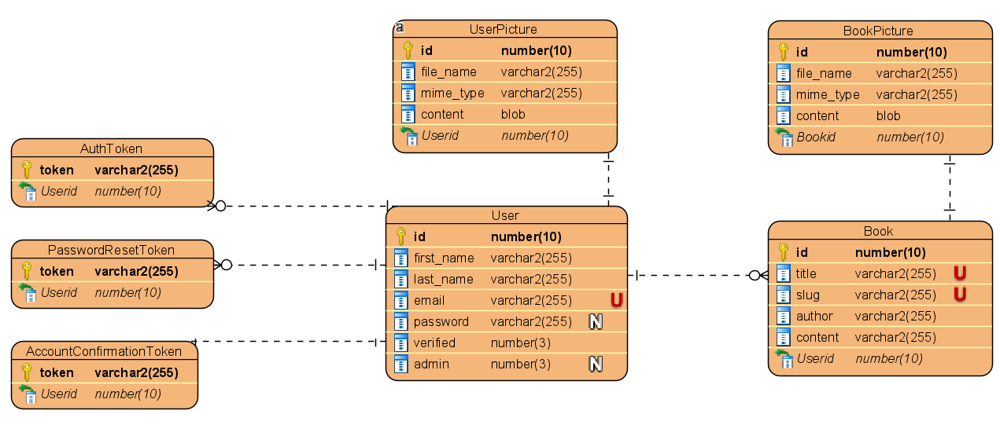

# Rent a book service

This web application was created during the advanced web development (IT-1, Djeroud) course of Efrei Paris (Group composed of Faris CHTATOU, Evan Mounaud, Yoni FELDMAN). The source code is available in main branch.

This web application was also created during the systems, application & services course (ST2SAS, SE-1, Charroux) (Group composed of Faris CHTATOU, Léa BUENDE, Bouthayna ATIK). The source code is available in feat/ST2SAS.

## Installation

Create a file named .env.development and .env (only if you need docker) at the root of the project which should be completed with the .env.example file [here](./.env.example). The application will not work if this step is not done, because the connection to the database will not be established.

First, you'll need node.js and node package manager "yarn" installed : [https://nodejs.org/en/].

- Our version of node.js : v14.17.6. **Make sure to use this version of node to avoid any compatibility issue**
- Our version of yarn : v1.22.15.

## Technologies

Our project uses the following technologies :

- The React framework for production Next.js for both front-end and back-end (React + Node.js running on the same server).
- A postgreSQL database.

## Getting Started

### Database Design



### With docker-compose

**This option is highly recommanded to avoid any env variable namming error**
With docker-compose all you have to do is first create the .env file  
**ATTENTION** Make sure to read and follow the steps correctly in .env.example file.

Once all these steps are done, all you have to do is :

```
docker-compose up
```

### Without docker

Install all the dependencies by running the following command :

```bash
yarn install
```

Create a file named .env.development and .env (only if you need docker) at the root of the project which should be completed with the .env.example file [here](./.env.example). The application will not work if this step is not done, because the connection to the database will not be established.

**ATTENTION**: The mailing system works with etheral service https://ethereal.email/login ! If you are willing to use another service, you will have to modify the constructor in the file /server/mails/index.js [here](./server/mails/index.js)

```
this.transporter = nodemailer.createTransport({
      host: "smtp.ethereal.email", //! For outlook use : "stmp-mail.outlouk.com"
      port: 587,
      //! Uncomment this in order to use Outlouk service
      // tls: {
      //   ciphers: "SSLv3",
      // },
      auth: {
        user: CREDENTIALS.APP_EMAIL,
        pass: CREDENTIALS.APP_PASSWORD,
      },
    })
    this.dateOptions = {
      weekday: "long",
      year: "numeric",
      month: "long",
      day: "2-digit",
    }
  }
```

Go to the file /server/database.js [here](./server/database.js) and change the following line of code :

On line 18 change false to true like following:

```
const sync = true
```

This line of code creates all the tables in database.

Then, run the development server:

```bash
yarn dev
```

Open [http://localhost:3000](http://localhost:3000) with your browser to see the result.

Go back to file /server/database.js and switch back to false.

```
const sync = false
```

Reload your browser, and that's it, your database is ready !

## Learn More

To learn more about Next.js, take a look at the following resources:

- [Next.js Documentation](https://nextjs.org/docs) - learn about Next.js features and API.
- [Learn Next.js](https://nextjs.org/learn) - an interactive Next.js tutorial.

You can check out [the Next.js GitHub repository](https://github.com/vercel/next.js/) - your feedback and contributions are welcome!
