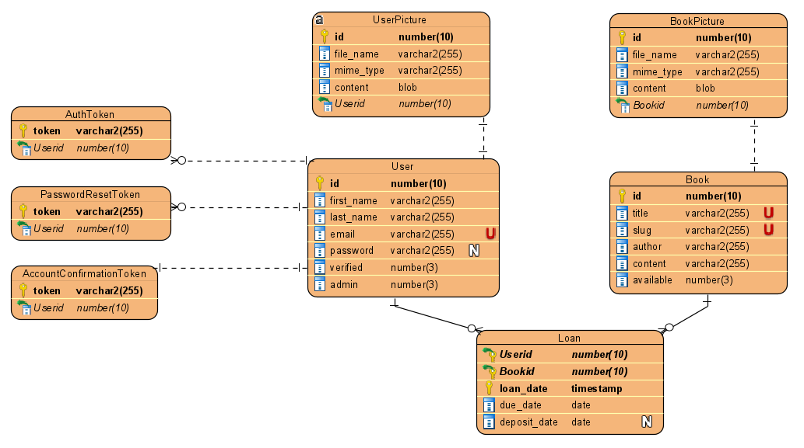

# Rent a book service

This web application was created during the advanced web development (IT-1, Djeroud) course of Efrei Paris (Group composed of Faris CHTATOU, Evan Mounaud, Yoni FELDMAN)
This web application was also created during the systems, application & services course (ST2SAS, SE-1, Charroux) (Group composed of Faris CHTATOU, Léa BUENDE, Bouthayna ATIK)

## Installation

First, you'll need node.js and node package manager "npm" installed : [https://nodejs.org/en/].

- Our version of node.js : v14.17.0. **Make sure to use this version of node to avoid any compatibility issue**
- Our version of npm : v7.12.1.

## Technologies

Our project uses the following technologies :

- The React framework for production Next.js for both front-end and back-end (React + Node.js running on the same server).
- A postgreSQL database.

## Getting Started

### Database Design



### With docker

#### Docker-Compose

##### With DockerFile use

**This option is highly recommanded to avoid any env variable namming error**
With docker-compose all you have to do is first create the .env file  
**ATTENTION** Make sure to read and follow the steps correctly in .env.example file.

Once all these steps are done, all you have to do is :

```
docker-compose up
```

##### Without DockerFile use

**ATTENTION** In this part, env variables must be the exact same as previously

All you have to do is replace line 16 of docker-compose.yml file

```
    build: ./
```

With

```
    image: farischt/project:latest
```

Once all these steps are done, all you have to do is :

```
docker-compose up
```

#### Manually

You can find [Our project](https://hub.docker.com/repository/docker/farischt/project)
This image comes with a predefined etheral email and application admin account :

- admin@admin.com
- Bonjour12345!

To use this image you'll first have to use the following cmd:

```
docker pull farischt/project:latest
docker network create -d bridge book-network
docker run -d --network=book-network -p 3000:3000 --name book_web farischt/project
```

Once this step is done, you will face a error 500 in your localhost:3000 since the database is not set yet.
This is why we highly recommand you to use docker-compose as written previously.

To create the database you will have to create a new postgres container:

```
docker pull postgres:alpine
docker run -d -p 5432:5432 --network=book-network --name book_db -v ./dump/:/docker-entrypoint-initdb.d -e POSTGRES_PASSWORD=<DB_PASSWORD in your .env file> postgres
docker exec -it book_db bash
psq -U postgres
```

**ATTENTION** in this case the database book is empty ! You should use volumes to init the database using [this](./dump/init.sql)

If you are facing any issue :

- Read the [official postgres image documentation](https://hub.docker.com/_/postgres)
- Feel free to contact us

### Without docker

Install all the dependencies by running the following command :

```bash
npm install
```

Create a file named .env.development and .env (only if you need docker) at the root of the project which should be completed with the .env.example file [here](./.env.example). The application will not work if this step is not done, because the connection to the database will not be established.

**ATTENTION**: The mailing system works with etheral service! If you are willing to use another service, you will have to modify the constructor in the file /server/mails/index.js [here](./server/mails/index.js)

```
this.transporter = nodemailer.createTransport({
      host: "smtp.ethereal.email", //! For outlook use : "stmp-mail.outlouk.com"
      port: 587,
      //! Uncomment this in order to use Outlouk service
      // tls: {
      //   ciphers: "SSLv3",
      // },
      auth: {
        user: CREDENTIALS.APP_EMAIL,
        pass: CREDENTIALS.APP_PASSWORD,
      },
    })
    this.dateOptions = {
      weekday: "long",
      year: "numeric",
      month: "long",
      day: "2-digit",
    }
  }
```

Go to the file /server/database.js [here](./server/database.js) and change the following line of code :

On line 18 change false to true like following:

```
const sync = true
```

This line of code creates all the tables in database.

Then, run the development server:

```bash
npm run dev
```

Open [http://localhost:3000](http://localhost:3000) with your browser to see the result.

Go back to file /server/database.js and switch back to false.

```
const sync = false
```

Reload your browser, and that's it, your database is ready !

## Learn More

To learn more about Next.js, take a look at the following resources:

- [Next.js Documentation](https://nextjs.org/docs) - learn about Next.js features and API.
- [Learn Next.js](https://nextjs.org/learn) - an interactive Next.js tutorial.

You can check out [the Next.js GitHub repository](https://github.com/vercel/next.js/) - your feedback and contributions are welcome!
